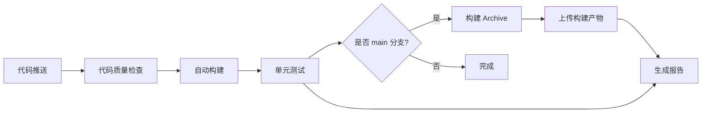

# GitHub Actions 自动化配置说明

## 📋 概述

本项目已配置完整的 CI/CD 流程，包括：
- ✅ 自动构建验证
- ✅ 代码质量检查（SwiftLint）
- ✅ 单元测试（预留）
- ✅ Archive 构建（main 分支）
- ✅ 构建报告生成

---

## 🚀 触发条件

### 自动触发
1. **推送到 main/develop 分支**：运行完整 CI 流程
2. **创建 Pull Request**：运行构建和检查
3. **合并到 main 分支**：额外生成 Archive

### 手动触发
可以在 GitHub Actions 页面手动运行工作流

---

## 📊 工作流程



---

## 🔧 配置文件说明

### 1. `.github/workflows/ios-ci.yml`
主 CI/CD 配置文件，定义了 5 个 Job：

#### Job 1: lint（代码质量检查）
- 安装 SwiftLint
- 运行代码规范检查
- **不阻塞流程**（仅警告）

#### Job 2: build（自动构建）
- 清理构建缓存
- 构建 iOS 应用
- 构建 Watch 应用（如果存在）
- **必须成功**才能继续

#### Job 3: test（单元测试）
- 在 iPhone 15 模拟器运行测试
- 当前预留（无测试用例）
- **不阻塞流程**

#### Job 4: archive（Archive 构建）
- 仅在 main 分支执行
- 生成 .xcarchive 文件
- 尝试导出 .ipa（需要证书）
- 上传构建产物（保留 7 天）

#### Job 5: report（构建报告）
- 统计代码行数
- 统计项目结构
- 生成 GitHub Actions 摘要

### 2. `.swiftlint.yml`
SwiftLint 配置文件：
- 启用代码规范检查
- 自定义规则（禁止 print 等）
- 排除第三方库和资源文件

### 3. `ExportOptions.plist`
Archive 导出配置：
- 需要替换 `YOUR_TEAM_ID` 为你的团队 ID
- 配置签名方式为 automatic

---

## 📈 查看构建状态

### GitHub Actions 页面
访问：https://github.com/djfireny-netizen/FocusFlow-iOS/actions

### 构建状态徽章
可以添加到 README：
```markdown
[](https://github.com/djfireny-netizen/FocusFlow-iOS/actions/workflows/ios-ci.yml)
```

---

## 🔐 证书配置（可选）

如果需要自动上传 TestFlight：

### 1. 获取 Team ID
1. 登录 [Apple Developer](https://developer.apple.com)
2. 进入 Membership 页面
3. 复制 Team ID

### 2. 更新 ExportOptions.plist
```xml
<key>teamID</key>
<string>YOUR_TEAM_ID</string>  <!-- 替换这里 -->
```

### 3. 配置证书密钥
需要在 GitHub Secrets 中添加：
- `APP_STORE_CONNECT_API_KEY_ID`
- `APP_STORE_CONNECT_API_ISSUER_ID`
- `APP_STORE_CONNECT_API_KEY_CONTENT`

---

## 🛠️ 本地运行 SwiftLint

在推送到 GitHub 前，建议在本地运行检查：

### 安装 SwiftLint
```bash
brew install swiftlint
```

### 运行检查
```bash
cd /Users/fireny/Desktop/Qoder/FocusFlow
swiftlint
```

### 自动修复
```bash
swiftlint --fix
```

---

## 📦 下载构建产物

Archive 构建完成后，可以在 GitHub Actions 页面下载：

1. 访问 Actions 页面
2. 点击最新的工作流运行
3. 找到 "构建 Archive" Job
4. 下载 `FocusFlow-Archive` 产物
5. 解压后得到 .xcarchive 和 .ipa 文件

---

## 🎯 最佳实践

### 提交前检查
1. 本地运行 `swiftlint` 确保没有严重警告
2. 本地运行 `xcodebuild build` 确保能够编译
3. 检查所有本地化文本是否正确

### 分支策略
- `main`：生产环境代码
- `develop`：开发环境代码
- `feature/*`：功能开发分支
- `bugfix/*`：Bug 修复分支

### PR 规范
- 使用 PR 模板
- 添加清晰的变更说明
- 附上截图（如有 UI 变更）
- 确保 CI 通过

---

## 🐛 故障排除

### 构建失败
1. 检查 Xcode 版本是否兼容
2. 查看完整日志定位错误
3. 本地复现并修复

### SwiftLint 警告过多
1. 运行 `swiftlint --fix` 自动修复
2. 在 `.swiftlint.yml` 中调整规则
3. 使用 `// swiftlint:disable` 注释忽略特定行

### Archive 导出失败
1. 检查 `ExportOptions.plist` 中的 Team ID
2. 确认已配置代码签名证书
3. 检查 Entitlements 配置

---

## 📞 支持

如有问题，请查看：
- [GitHub Actions 文档](https://docs.github.com/en/actions)
- [SwiftLint 文档](https://github.com/realm/SwiftLint)
- [Xcodebuild 文档](https://developer.apple.com/documentation/xcode/building-your-app-from-the-command-line)

---

**最后更新**: 2026-04-09
